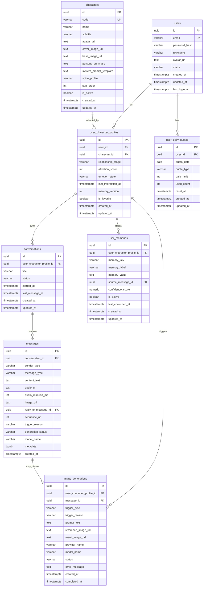

# 纸片人女友 2.0 数据库设计

## 1. 文档目标

本文档用于整理 `纸片人女友 2.0` 的核心数据库设计方案，服务于以下目标：

- 支撑第一版核心功能落地
- 保证多角色、独立记忆、多模态消息和图片额度等需求可扩展
- 为后续建表 SQL、ORM Schema、接口设计提供统一参考

本文档当前聚焦产品域核心数据，不包含第三方认证库自动生成的系统表。

## 2. 设计原则

### 2.1 先满足 P0，再为 P1/P2 预留扩展

数据库设计优先保证以下能力可稳定落地：

- 用户注册登录
- 多角色选择
- 微信风格聊天
- 文本、语音、图片消息
- 独立记忆
- 图片额度控制

在此基础上，对 `隐藏情绪系统`、`社交登录`、`主动触达` 等后续功能预留字段或扩展点。

### 2.2 关系数据独立建模

本产品不是单纯的 `用户 -> 消息` 结构，而是 `用户 -> 角色 -> 关系 -> 会话 -> 消息`。

因为用户可以切换多个角色，而且每个角色与该用户之间的聊天记录、记忆和状态都独立，因此必须引入 `用户-角色关系层`，避免后续返工。

### 2.3 多模态消息统一归档

第一版消息结构需要同时支持：

- 文本消息
- 语音消息
- 图片消息

因此消息表采用统一消息模型，而不是一开始就拆成多张子表。

### 2.4 成本能力必须可跟踪

图片生成和后续多模态能力存在明显成本，因此数据库中必须保留：

- 图片生成记录
- 图片额度记录
- 失败状态
- 触发原因

## 3. 核心实体与表关系

本期核心采用以下 `8` 张表：

1. `users`
2. `characters`
3. `user_character_profiles`
4. `conversations`
5. `messages`
6. `user_memories`
7. `image_generations`
8. `user_daily_quotas`

### 3.1 关系说明

- 一个 `user` 可以选择多个 `character`
- 一个 `character` 可以被多个 `user` 选择
- `user_character_profiles` 用于存储“某个用户与某个角色之间”的独立关系状态
- 一个 `user_character_profile` 下可以有多个 `conversation`
- 一个 `conversation` 下可以有多条 `message`
- 一个 `user_character_profile` 下可以有多条 `user_memory`
- 一个 `user_character_profile` 下可以有多条 `image_generation`
- 一个 `user` 下可以有多条 `user_daily_quota`

### 3.2 关系结构图

```text
users
  └── user_character_profiles
        ├── conversations
        │     └── messages
        ├── user_memories
        └── image_generations

characters
  └── user_character_profiles

users
  └── user_daily_quotas
```

### 3.3 Mermaid ER 图



## 4. 表设计详情

## 4.1 `users`

### 表作用

存储产品用户基础信息，是登录、额度控制和跨角色身份识别的基础表。

### 建议字段

| 字段名 | 类型建议 | 是否必填 | 说明 |
| --- | --- | --- | --- |
| `id` | `uuid` | 是 | 主键 |
| `email` | `varchar(255)` | 是 | 用户邮箱，唯一 |
| `password_hash` | `varchar(255)` | 是 | 密码哈希 |
| `nickname` | `varchar(100)` | 否 | 用户昵称 |
| `avatar_url` | `text` | 否 | 用户头像地址 |
| `status` | `varchar(32)` | 是 | 用户状态，如 `active` |
| `created_at` | `timestamptz` | 是 | 创建时间 |
| `updated_at` | `timestamptz` | 是 | 更新时间 |
| `last_login_at` | `timestamptz` | 否 | 最后登录时间 |

### 约束与索引建议

- 主键：`id`
- 唯一索引：`email`

### 设计说明

- 当前第一版先采用邮箱注册登录，这张表足够支撑基础认证场景。
- 后续若接入 BetterAuth 或社交登录，通常会增加第三方认证系统表，但本表仍保留为产品主用户表。
- `status` 用于支持后续的封禁、冻结、注销等状态控制。

## 4.2 `characters`

### 表作用

存储预设虚拟女友角色，是产品核心内容资产。

### 建议字段

| 字段名 | 类型建议 | 是否必填 | 说明 |
| --- | --- | --- | --- |
| `id` | `uuid` | 是 | 主键 |
| `code` | `varchar(64)` | 是 | 角色唯一编码 |
| `name` | `varchar(100)` | 是 | 角色名称 |
| `subtitle` | `varchar(255)` | 否 | 一句话简介 |
| `avatar_url` | `text` | 否 | 角色头像 |
| `cover_image_url` | `text` | 否 | 角色封面 |
| `base_image_url` | `text` | 否 | 图生图基准图 |
| `persona_summary` | `text` | 否 | 人设摘要 |
| `system_prompt_template` | `text` | 否 | 角色系统提示词模板 |
| `voice_profile` | `varchar(100)` | 否 | 角色音色配置标识 |
| `sort_order` | `int` | 是 | 排序值 |
| `is_active` | `boolean` | 是 | 是否启用 |
| `created_at` | `timestamptz` | 是 | 创建时间 |
| `updated_at` | `timestamptz` | 是 | 更新时间 |

### 约束与索引建议

- 主键：`id`
- 唯一索引：`code`
- 普通索引：`is_active`, `sort_order`

### 设计说明

- 角色信息不建议写死在前端，应该放在数据库中统一维护。
- `base_image_url` 是角色视觉一致性的核心锚点字段。
- `voice_profile` 方便未来不同角色绑定不同音色或 TTS 配置。
- `is_active` 用于角色上架、下架控制。

## 4.3 `user_character_profiles`

### 表作用

存储某个用户与某个角色之间的独立关系档案，是整个设计中最关键的一张表。

### 建议字段

| 字段名 | 类型建议 | 是否必填 | 说明 |
| --- | --- | --- | --- |
| `id` | `uuid` | 是 | 主键 |
| `user_id` | `uuid` | 是 | 外键，关联 `users.id` |
| `character_id` | `uuid` | 是 | 外键，关联 `characters.id` |
| `relationship_stage` | `varchar(32)` | 是 | 关系阶段，默认 `new_couple` |
| `affection_score` | `int` | 否 | 隐藏好感度，预留字段 |
| `emotion_state` | `varchar(64)` | 否 | 当前情绪或关系状态摘要 |
| `last_interaction_at` | `timestamptz` | 否 | 最近互动时间 |
| `memory_version` | `int` | 否 | 记忆版本号，预留字段 |
| `is_favorite` | `boolean` | 是 | 是否为用户常用角色 |
| `created_at` | `timestamptz` | 是 | 创建时间 |
| `updated_at` | `timestamptz` | 是 | 更新时间 |

### 约束与索引建议

- 主键：`id`
- 外键：`user_id` -> `users.id`
- 外键：`character_id` -> `characters.id`
- 联合唯一索引：`(user_id, character_id)`
- 普通索引：`user_id`
- 普通索引：`character_id`
- 普通索引：`last_interaction_at`

### 设计说明

- 因为一个用户可以切换多个角色，且每个角色的记忆、关系状态、历史都不同，所以必须抽象这一层。
- `relationship_stage` 虽然当前默认设定为“刚确定关系不久的恋人”，但保留字段有利于后续情绪系统或关系深化逻辑。
- `affection_score` 和 `emotion_state` 先预留，不要求第一版立即用上。
- 这张表后续会成为会话、记忆、图片、情绪状态等能力的聚合中心。

## 4.4 `conversations`

### 表作用

存储会话信息，用于组织聊天历史、分页和时间线展示。

### 建议字段

| 字段名 | 类型建议 | 是否必填 | 说明 |
| --- | --- | --- | --- |
| `id` | `uuid` | 是 | 主键 |
| `user_character_profile_id` | `uuid` | 是 | 外键，关联 `user_character_profiles.id` |
| `title` | `varchar(255)` | 否 | 会话标题 |
| `status` | `varchar(32)` | 是 | 会话状态，如 `active` |
| `started_at` | `timestamptz` | 是 | 会话开始时间 |
| `last_message_at` | `timestamptz` | 否 | 最近消息时间 |
| `created_at` | `timestamptz` | 是 | 创建时间 |
| `updated_at` | `timestamptz` | 是 | 更新时间 |

### 约束与索引建议

- 主键：`id`
- 外键：`user_character_profile_id` -> `user_character_profiles.id`
- 普通索引：`user_character_profile_id`
- 普通索引：`last_message_at`

### 设计说明

- 即使第一版前端看起来只有一个持续聊天框，也建议保留会话层。
- 这样未来要做历史会话回顾、归档、分段展示时，不需要重构消息结构。
- `last_message_at` 用于按最近互动排序。

## 4.5 `messages`

### 表作用

存储所有聊天消息，是产品主流水表。

### 建议字段

| 字段名 | 类型建议 | 是否必填 | 说明 |
| --- | --- | --- | --- |
| `id` | `uuid` | 是 | 主键 |
| `conversation_id` | `uuid` | 是 | 外键，关联 `conversations.id` |
| `sender_type` | `varchar(32)` | 是 | 发送方类型，如 `user`、`character`、`system` |
| `message_type` | `varchar(32)` | 是 | 消息类型，如 `text`、`audio`、`image`、`mixed` |
| `content_text` | `text` | 否 | 文本内容 |
| `audio_url` | `text` | 否 | 语音地址 |
| `audio_duration_ms` | `int` | 否 | 语音时长，毫秒 |
| `image_url` | `text` | 否 | 图片地址 |
| `reply_to_message_id` | `uuid` | 否 | 回复哪条消息 |
| `sequence_no` | `int` | 是 | 会话内顺序号 |
| `trigger_reason` | `varchar(64)` | 否 | 触发原因 |
| `generation_status` | `varchar(32)` | 是 | 生成状态，如 `completed` |
| `model_name` | `varchar(100)` | 否 | 使用的模型名称 |
| `metadata` | `jsonb` | 否 | 扩展信息 |
| `created_at` | `timestamptz` | 是 | 创建时间 |

### 约束与索引建议

- 主键：`id`
- 外键：`conversation_id` -> `conversations.id`
- 外键：`reply_to_message_id` -> `messages.id`
- 联合索引：`(conversation_id, sequence_no)`
- 普通索引：`created_at`
- 可选索引：`sender_type`

### 设计说明

- 第一版消息模型需要统一支持文本、语音、图片三类能力，因此不建议一开始拆成多张表。
- `trigger_reason` 用于记录语音或图片为何出现，方便后续分析触发规则是否合理。
- `metadata` 可用于存储情绪标签、上下文引用、分条信息等扩展内容。
- 因为产品强调“长消息拆成多条发送”，一次 AI 回复可以对应多条 `messages`，这在数据结构上是允许且合理的。

## 4.6 `user_memories`

### 表作用

存储角色对用户的记忆内容，是陪伴感和连续性的核心数据表。

### 建议字段

| 字段名 | 类型建议 | 是否必填 | 说明 |
| --- | --- | --- | --- |
| `id` | `uuid` | 是 | 主键 |
| `user_character_profile_id` | `uuid` | 是 | 外键，关联 `user_character_profiles.id` |
| `memory_key` | `varchar(64)` | 是 | 记忆键，如 `birthday` |
| `memory_label` | `varchar(64)` | 是 | 中文展示名，如 `生日` |
| `memory_value` | `text` | 是 | 记忆值 |
| `source_message_id` | `uuid` | 否 | 来源消息 |
| `confidence_score` | `numeric(5,2)` | 否 | LLM 提取置信度 |
| `is_active` | `boolean` | 是 | 是否有效 |
| `last_confirmed_at` | `timestamptz` | 否 | 最近确认时间 |
| `created_at` | `timestamptz` | 是 | 创建时间 |
| `updated_at` | `timestamptz` | 是 | 更新时间 |

### 约束与索引建议

- 主键：`id`
- 外键：`user_character_profile_id` -> `user_character_profiles.id`
- 外键：`source_message_id` -> `messages.id`
- 普通索引：`user_character_profile_id`
- 普通索引：`memory_key`
- 可选索引：`is_active`

### 设计说明

- 当前产品记忆策略采用键值对形式，这是符合第一版复杂度的设计。
- 仅有 `key/value` 不足以支撑后续追溯，因此补充了 `memory_label`、`source_message_id`、`confidence_score`、`is_active`。
- `is_active` 有助于后续处理旧记忆失效、信息修正、用户改口等情况，而不必物理删除数据。

## 4.7 `image_generations`

### 表作用

存储图片生成任务与结果，用于追踪图片成本、失败状态和触发来源。

### 建议字段

| 字段名 | 类型建议 | 是否必填 | 说明 |
| --- | --- | --- | --- |
| `id` | `uuid` | 是 | 主键 |
| `user_character_profile_id` | `uuid` | 是 | 外键，关联 `user_character_profiles.id` |
| `message_id` | `uuid` | 否 | 关联消息 |
| `trigger_type` | `varchar(32)` | 是 | 触发类型，如 `auto`、`user_request` |
| `trigger_reason` | `varchar(64)` | 否 | 触发原因 |
| `prompt_text` | `text` | 否 | 生图提示词 |
| `reference_image_url` | `text` | 否 | 参考图地址 |
| `result_image_url` | `text` | 否 | 结果图地址 |
| `provider_name` | `varchar(100)` | 否 | 服务商 |
| `model_name` | `varchar(100)` | 否 | 模型名 |
| `status` | `varchar(32)` | 是 | 状态，如 `pending`、`success`、`failed` |
| `error_message` | `text` | 否 | 失败原因 |
| `created_at` | `timestamptz` | 是 | 创建时间 |
| `completed_at` | `timestamptz` | 否 | 完成时间 |

### 约束与索引建议

- 主键：`id`
- 外键：`user_character_profile_id` -> `user_character_profiles.id`
- 外键：`message_id` -> `messages.id`
- 普通索引：`user_character_profile_id`
- 普通索引：`status`
- 普通索引：`created_at`

### 设计说明

- 图片生成成本高、耗时长、失败率也更高，因此不建议只在消息表中保留图片 URL。
- 单独记录图片任务后，可以更容易做失败重试、额度统计、问题排查和成本分析。
- `reference_image_url` 主要用于保存当前角色基准图来源。

## 4.8 `user_daily_quotas`

### 表作用

存储用户每日额度控制信息，第一版主要用于图片额度管理。

### 建议字段

| 字段名 | 类型建议 | 是否必填 | 说明 |
| --- | --- | --- | --- |
| `id` | `uuid` | 是 | 主键 |
| `user_id` | `uuid` | 是 | 外键，关联 `users.id` |
| `quota_date` | `date` | 是 | 配额日期 |
| `quota_type` | `varchar(64)` | 是 | 配额类型，如 `image_generation` |
| `daily_limit` | `int` | 是 | 每日上限 |
| `used_count` | `int` | 是 | 已使用次数 |
| `reset_at` | `timestamptz` | 否 | 理论重置时间 |
| `created_at` | `timestamptz` | 是 | 创建时间 |
| `updated_at` | `timestamptz` | 是 | 更新时间 |

### 约束与索引建议

- 主键：`id`
- 外键：`user_id` -> `users.id`
- 联合唯一索引：`(user_id, quota_date, quota_type)`
- 普通索引：`quota_date`

### 设计说明

- 当前图片额度规则为：所有角色共享、每个用户每天最多 `10` 张。
- `quota_type` 让这张表未来可复用到语音额度、高成本模型额度等控制场景。
- 如果后续要做套餐、会员或动态额度，也可以在这张表基础上扩展。

## 5. 第一版推荐枚举值

以下枚举值建议在代码层统一管理，数据库中先用字符串存储，避免过早绑定复杂枚举类型。

### 5.1 `users.status`

- `active`
- `disabled`
- `deleted`

### 5.2 `user_character_profiles.relationship_stage`

- `new_couple`

说明：

- 当前阶段先保留一个默认值即可，后续如果需要扩展关系深化逻辑，再增加新的阶段值。

### 5.3 `conversations.status`

- `active`
- `archived`

### 5.4 `messages.sender_type`

- `user`
- `character`
- `system`

### 5.5 `messages.message_type`

- `text`
- `audio`
- `image`
- `mixed`

### 5.6 `messages.generation_status`

- `pending`
- `completed`
- `failed`

### 5.7 `image_generations.trigger_type`

- `auto`
- `user_request`

### 5.8 `image_generations.status`

- `pending`
- `success`
- `failed`

### 5.9 `user_daily_quotas.quota_type`

- `image_generation`

## 6. 字段最终确认

本节将字段分为两类：

- `第一版必建字段`：当前进入 SQL 或 ORM Schema 时必须落地的字段
- `预留字段`：保留在设计中，但如果你想先快速推进编码，可以晚一点再真正启用

### 6.1 通用约定

- 所有主键统一使用 `uuid`
- 所有时间字段统一使用 `timestamptz`
- 所有 URL 字段统一使用 `text`
- 所有状态类字段第一版先用 `varchar` 存储，由代码层维护枚举值
- 所有 `created_at`、`updated_at` 默认由数据库写入当前时间

### 6.2 `users` 最终字段确认

#### 第一版必建字段

| 字段名 | 类型建议 | 默认值 | 备注 |
| --- | --- | --- | --- |
| `id` | `uuid` | 无 | 主键 |
| `email` | `varchar(255)` | 无 | 唯一 |
| `password_hash` | `varchar(255)` | 无 | 登录必需 |
| `nickname` | `varchar(100)` | `null` | 可后补 |
| `avatar_url` | `text` | `null` | 可后补 |
| `status` | `varchar(32)` | `active` | 用户状态 |
| `created_at` | `timestamptz` | `now()` | 创建时间 |
| `updated_at` | `timestamptz` | `now()` | 更新时间 |
| `last_login_at` | `timestamptz` | `null` | 登录后更新 |

#### 预留字段

- 当前无额外预留字段

### 6.3 `characters` 最终字段确认

#### 第一版必建字段

| 字段名 | 类型建议 | 默认值 | 备注 |
| --- | --- | --- | --- |
| `id` | `uuid` | 无 | 主键 |
| `code` | `varchar(64)` | 无 | 唯一角色编码 |
| `name` | `varchar(100)` | 无 | 角色名称 |
| `subtitle` | `varchar(255)` | `null` | 一句话简介 |
| `avatar_url` | `text` | `null` | 角色头像 |
| `cover_image_url` | `text` | `null` | 角色封面 |
| `base_image_url` | `text` | `null` | 图生图基准图 |
| `persona_summary` | `text` | `null` | 人设摘要 |
| `system_prompt_template` | `text` | `null` | Prompt 模板 |
| `voice_profile` | `varchar(100)` | `null` | 音色配置 |
| `sort_order` | `int` | `0` | 排序 |
| `is_active` | `boolean` | `true` | 是否启用 |
| `created_at` | `timestamptz` | `now()` | 创建时间 |
| `updated_at` | `timestamptz` | `now()` | 更新时间 |

#### 预留字段

- 当前无额外预留字段

### 6.4 `user_character_profiles` 最终字段确认

#### 第一版必建字段

| 字段名 | 类型建议 | 默认值 | 备注 |
| --- | --- | --- | --- |
| `id` | `uuid` | 无 | 主键 |
| `user_id` | `uuid` | 无 | 外键 |
| `character_id` | `uuid` | 无 | 外键 |
| `relationship_stage` | `varchar(32)` | `new_couple` | 默认刚确定关系不久 |
| `last_interaction_at` | `timestamptz` | `null` | 最近互动时间 |
| `created_at` | `timestamptz` | `now()` | 创建时间 |
| `updated_at` | `timestamptz` | `now()` | 更新时间 |

#### 预留字段

| 字段名 | 类型建议 | 说明 |
| --- | --- | --- |
| `affection_score` | `int` | 隐藏好感度 |
| `emotion_state` | `varchar(64)` | 当前关系情绪摘要 |
| `memory_version` | `int` | 记忆版本号 |
| `is_favorite` | `boolean` | 是否常用角色 |

### 6.5 `conversations` 最终字段确认

#### 第一版必建字段

| 字段名 | 类型建议 | 默认值 | 备注 |
| --- | --- | --- | --- |
| `id` | `uuid` | 无 | 主键 |
| `user_character_profile_id` | `uuid` | 无 | 外键 |
| `title` | `varchar(255)` | `null` | 会话标题 |
| `status` | `varchar(32)` | `active` | 会话状态 |
| `started_at` | `timestamptz` | `now()` | 开始时间 |
| `last_message_at` | `timestamptz` | `null` | 最近消息时间 |
| `created_at` | `timestamptz` | `now()` | 创建时间 |
| `updated_at` | `timestamptz` | `now()` | 更新时间 |

#### 预留字段

- 当前无额外预留字段

### 6.6 `messages` 最终字段确认

#### 第一版必建字段

| 字段名 | 类型建议 | 默认值 | 备注 |
| --- | --- | --- | --- |
| `id` | `uuid` | 无 | 主键 |
| `conversation_id` | `uuid` | 无 | 外键 |
| `sender_type` | `varchar(32)` | 无 | `user` / `character` / `system` |
| `message_type` | `varchar(32)` | `text` | `text` / `audio` / `image` / `mixed` |
| `content_text` | `text` | `null` | 文本内容 |
| `audio_url` | `text` | `null` | 语音地址 |
| `image_url` | `text` | `null` | 图片地址 |
| `sequence_no` | `int` | 无 | 会话内顺序号 |
| `trigger_reason` | `varchar(64)` | `null` | 触发原因 |
| `generation_status` | `varchar(32)` | `completed` | 生成状态 |
| `created_at` | `timestamptz` | `now()` | 创建时间 |

#### 预留字段

| 字段名 | 类型建议 | 说明 |
| --- | --- | --- |
| `reply_to_message_id` | `uuid` | 回复链路 |
| `audio_duration_ms` | `int` | 语音时长 |
| `model_name` | `varchar(100)` | 模型名 |
| `metadata` | `jsonb` | 扩展信息 |

### 6.7 `user_memories` 最终字段确认

#### 第一版必建字段

| 字段名 | 类型建议 | 默认值 | 备注 |
| --- | --- | --- | --- |
| `id` | `uuid` | 无 | 主键 |
| `user_character_profile_id` | `uuid` | 无 | 外键 |
| `memory_key` | `varchar(64)` | 无 | 英文记忆键 |
| `memory_label` | `varchar(64)` | 无 | 中文展示名 |
| `memory_value` | `text` | 无 | 记忆内容 |
| `source_message_id` | `uuid` | `null` | 来源消息 |
| `confidence_score` | `numeric(5,2)` | `null` | 置信度 |
| `is_active` | `boolean` | `true` | 是否有效 |
| `last_confirmed_at` | `timestamptz` | `null` | 最近确认时间 |
| `created_at` | `timestamptz` | `now()` | 创建时间 |
| `updated_at` | `timestamptz` | `now()` | 更新时间 |

#### 预留字段

- 当前无额外预留字段

### 6.8 `image_generations` 最终字段确认

#### 第一版必建字段

| 字段名 | 类型建议 | 默认值 | 备注 |
| --- | --- | --- | --- |
| `id` | `uuid` | 无 | 主键 |
| `user_character_profile_id` | `uuid` | 无 | 外键 |
| `message_id` | `uuid` | `null` | 关联消息 |
| `trigger_type` | `varchar(32)` | 无 | `auto` / `user_request` |
| `trigger_reason` | `varchar(64)` | `null` | 触发原因 |
| `prompt_text` | `text` | `null` | 生图提示词 |
| `reference_image_url` | `text` | `null` | 参考图 |
| `result_image_url` | `text` | `null` | 结果图 |
| `provider_name` | `varchar(100)` | `null` | 服务商 |
| `model_name` | `varchar(100)` | `null` | 模型名 |
| `status` | `varchar(32)` | `pending` | 任务状态 |
| `error_message` | `text` | `null` | 错误原因 |
| `created_at` | `timestamptz` | `now()` | 创建时间 |
| `completed_at` | `timestamptz` | `null` | 完成时间 |

#### 预留字段

- 当前无额外预留字段

### 6.9 `user_daily_quotas` 最终字段确认

#### 第一版必建字段

| 字段名 | 类型建议 | 默认值 | 备注 |
| --- | --- | --- | --- |
| `id` | `uuid` | 无 | 主键 |
| `user_id` | `uuid` | 无 | 外键 |
| `quota_date` | `date` | 无 | 配额日期 |
| `quota_type` | `varchar(64)` | 无 | 配额类型 |
| `daily_limit` | `int` | `10` | 当前图片每日上限 |
| `used_count` | `int` | `0` | 已使用次数 |
| `reset_at` | `timestamptz` | `null` | 理论重置时间 |
| `created_at` | `timestamptz` | `now()` | 创建时间 |
| `updated_at` | `timestamptz` | `now()` | 更新时间 |

#### 预留字段

- 当前无额外预留字段

## 7. 第一版落地建议

### 6.1 建议优先完整落地的表

以下表建议第一版就完整建设：

- `users`
- `characters`
- `conversations`
- `user_memories`
- `image_generations`
- `user_daily_quotas`

### 6.2 建议优先落核心字段的表

#### `user_character_profiles`

第一版至少需要以下字段：

- `id`
- `user_id`
- `character_id`
- `relationship_stage`
- `last_interaction_at`
- `created_at`
- `updated_at`

可以先预留但不立即启用：

- `affection_score`
- `emotion_state`
- `memory_version`
- `is_favorite`

#### `messages`

第一版至少需要以下字段：

- `id`
- `conversation_id`
- `sender_type`
- `message_type`
- `content_text`
- `audio_url`
- `image_url`
- `sequence_no`
- `trigger_reason`
- `generation_status`
- `created_at`

可以先预留但不立即启用：

- `reply_to_message_id`
- `audio_duration_ms`
- `model_name`
- `metadata`

## 8. 未来扩展方向

### 7.1 情绪系统

可基于以下字段扩展：

- `user_character_profiles.affection_score`
- `user_character_profiles.emotion_state`
- `messages.metadata`

### 7.2 社交登录

后续接入 BetterAuth 或其他认证方案时，通常会引入额外认证系统表，例如：

- 账号表
- session 表
- 验证 token 表

这些表不属于当前产品域核心设计范围。

### 7.3 主动触达

后续如需支持邮件召回、定时任务，可新增：

- `reminder_jobs`
- `user_notification_preferences`

### 7.4 分享卡片

后续可新增：

- `share_cards`
- `share_events`

## 9. 当前待确认事项

以下内容与数据库设计紧密相关，但尚未完全定稿：

- 记忆更新与冲突解决规则
- 语音文件存储方式
- 图片文件存储方式
- 图片和音频是否走对象存储
- 会话创建规则，是单长期会话还是按时间分段
- 删除策略，是物理删除还是软删除
- 后续是否需要后台管理表

## 10. 下一步建议

完成本文档后，推荐按以下顺序继续推进：

1. 依据本文档产出 SQL 建表稿或 ORM Schema
2. 明确记忆更新与冲突规则
3. 明确文件存储方案
4. 设计数据迁移方案
5. 进入接口设计和代码实现
